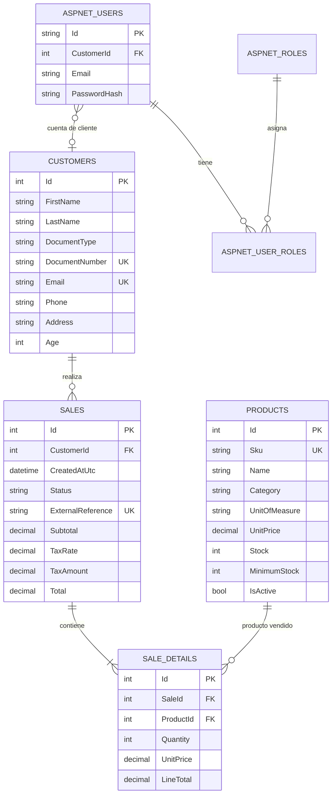
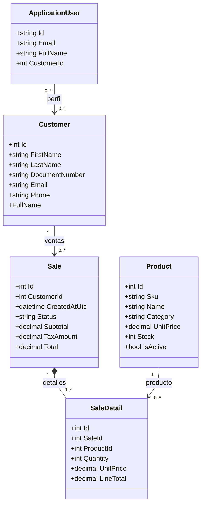

# Firmeza — Gestión administrativa

Aplicación administrativa para una empresa de comercialización y distribución de materiales de construcción. Incluye autenticación por roles, panel Razor, API REST para un frontend Angular, CRUD de productos y clientes, consulta y registro de ventas, persistencia PostgreSQL con Entity Framework Core y base preparada para despliegue en contenedores.

## Tecnologías

- .NET 8 / ASP.NET Core MVC con vistas Razor.
- API REST protegida por ASP.NET Core Identity y cookies de autenticación.
- ASP.NET Core Identity para usuarios, contraseñas y roles.
- Entity Framework Core 8 y proveedor Npgsql para PostgreSQL 16.
- Bootstrap 5.3 y estilos propios adaptables a móvil.
- EPPlus para importación/exportación de Excel y QuestPDF para informes y recibos PDF.
- xUnit para pruebas unitarias de validación de dominio.

## Estructura

```text
Firmeza.sln
├── src/Firmeza.Web/       Aplicación MVC, modelos y migraciones EF Core
└── tests/Firmeza.Tests/   Pruebas unitarias
```

## Funcionalidad incluida

- Inicio de sesión administrativo y registro de cuentas de cliente.
- Roles `Administrador` y `Cliente`; todas las vistas operativas están autorizadas exclusivamente al rol Administrador. Un cliente no puede abrir el panel Razor.
- Dashboard con cantidades de productos activos, clientes, ventas e ingresos de hoy, y actividad reciente.
- Alta, consulta, edición y baja lógica de productos, con búsqueda, categoría, validación, stock y SKU único.
- Alta, consulta, edición y eliminación de clientes, con búsqueda, documento único y validación de correo/teléfono.
- Registro de ventas con validación de stock, descuento de existencias, IVA configurable y recibo PDF descargable.
- Importación multitabla desde Excel con normalización de encabezados, actualización por SKU/documento, transacción e informe descargable de inconsistencias.
- Exportación de productos, clientes y ventas a Excel y PDF desde el panel administrativo.
- Endpoints JSON para autenticación, dashboard, productos, clientes, ventas, recibos e importación/exportación de reportes.
- Esquema creado y actualizado exclusivamente mediante migraciones EF Core. La aplicación aplica las migraciones pendientes al iniciar.

## Requisitos

- .NET SDK 8.0 o posterior compatible con el destino `net8.0`.
- PostgreSQL 16 (local o mediante Docker).

## Ejecución local

1. Inicia PostgreSQL y crea un usuario/base de datos. No se requiere cargar scripts SQL para crear el esquema.
2. Configura `ConnectionStrings:DefaultConnection` en `src/Firmeza.Web/appsettings.json` o, preferiblemente, sobrescribe con la variable `ConnectionStrings__DefaultConnection`.
3. Antes del primer arranque, configura una contraseña segura para el administrador mediante User Secrets en desarrollo o `AdminSeed__Password` en el entorno desplegado. No hay una contraseña administrativa predeterminada; si no se configura, se crean los roles pero no una cuenta administradora.
4. Desde la raíz del repositorio ejecuta:

   ```bash
   dotnet restore Firmeza.sln
   dotnet run --project src/Firmeza.Web/Firmeza.Web.csproj
   ```

5. Abre `http://localhost:5080`. La base se migra automáticamente al arranque.

Para Supabase, guarda la cadena PostgreSQL en User Secrets durante el desarrollo o en el gestor de secretos del entorno desplegado; nunca la escribas en `appsettings.json` ni la subas a Git. El backend usa Npgsql, por lo que la cadena debe tener formato `Host=...;Port=...;Database=...;Username=...;Password=...;SSL Mode=Require`.

La migración `LegacySupabaseBaseline` reconoce el esquema anterior de Firmeza que contiene `Customers.Name` y `Products.Price`. Si lo encuentra sin el historial inicial de EF, conserva los registros, adapta esas columnas, asigna SKU y documento `LEGACY-<Id>` cuando corresponde y crea las tablas de ASP.NET Identity. Solo se ejecuta si el historial aún no contiene ni el baseline ni la migración inicial; así los siguientes arranques no revierten migraciones posteriores. La migración se detiene con error si detecta datos incompatibles o un esquema distinto al esperado. Haz y verifica un respaldo antes de conectar una base con datos. En bases nuevas no altera tablas de negocio; la migración inicial crea el esquema normal.

El frontend Angular se ejecuta por separado en `http://localhost:4200`; su proxy de desarrollo reenvía las solicitudes `/api` a este backend. Sigue las instrucciones del README del frontend para iniciar ambos procesos.

Si se agregan cambios a las entidades, crear y versionar una migración con:

```bash
dotnet ef migrations add NombreDelCambio --project src/Firmeza.Web --startup-project src/Firmeza.Web
```

La migración es el registro del cambio del esquema. No se deben crear las tablas manualmente ni mantener scripts SQL paralelos.

## Usuario administrativo inicial

El arranque garantiza los roles `Administrador` y `Cliente`. Si se configuran `AdminSeed:Email` y `AdminSeed:Password` y no existe esa cuenta, la crea y asigna al rol Administrador. El correo predeterminado es solo para desarrollo; no existe contraseña predeterminada. Los usuarios registrados desde el formulario reciben exclusivamente el rol Cliente.

## Docker Compose

Con Docker Engine y el complemento Compose instalados, desde la raíz del backend:

```bash
docker compose up --build
```

Opcionalmente copia `.env.example` a `.env` y cambia las contraseñas antes de levantar los contenedores.

La aplicación Angular queda en `http://localhost:4200`, la API en `http://localhost:5080` y PostgreSQL de prueba en el puerto `5432`. El frontend se sirve con Nginx y envía `/api` al contenedor web. La base de datos es un contenedor local desechable para desarrollo; no se conecta a servicios externos. Volúmenes preservan los datos y recibos entre reinicios y el servicio web espera el healthcheck de PostgreSQL. Se pueden configurar `POSTGRES_PASSWORD`, `ADMIN_EMAIL` y `ADMIN_PASSWORD` en `.env` antes de levantarlo. Para detener sin borrar los datos de prueba: `docker compose down`; para eliminarlos también: `docker compose down -v`.

El Dockerfile usa imágenes oficiales .NET 8 y publica en modo Release.

## Pruebas

```bash
dotnet test Firmeza.sln
```

Las pruebas actuales verifican validaciones de precio/stock del producto, rango de edad del cliente, normalización de encabezados Excel y generación de PDF.

## API REST

Las rutas `/api` responden JSON y no redirigen a las vistas Razor cuando falta autenticación:

- `GET /api/auth/csrf`, `POST /api/auth/login`, `GET /api/auth/me`, `POST /api/auth/logout`.
- `/api/products` y `/api/customers`: lectura, creación, edición y eliminación/desactivación.
- `GET /api/dashboard`: indicadores del mes y transacciones recientes.
- `/api/sales`: consulta y registro transaccional de ventas; `/api/sales/{id}/receipt` descarga el recibo.
- `/api/reports/products`, `/api/reports/customers`, `/api/reports/sales`: exportan con `?format=xlsx` o `?format=pdf`.
- `GET /api/reports/import/template` y `POST /api/reports/import`: plantilla e importación Excel.

Todas las operaciones salvo el inicio de sesión y la obtención del token CSRF exigen una sesión con rol `Administrador`. Las solicitudes que modifican datos requieren enviar el token de `GET /api/auth/csrf` en la cabecera `X-CSRF-TOKEN`.

## Importaciones, exportaciones y recibos

En el panel abre **Importar / exportar**. La plantilla descargable incluye encabezados para cargar productos, clientes y ventas en una misma hoja; también se aceptan varios libros/hojas, siempre con los encabezados en la primera fila. Los encabezados se normalizan sin distinguir mayúsculas, espacios ni acentos. Se reconocen, entre otros:

- Producto: `SKU`, `Código`, `Producto` o `Nombre producto`, `Categoría`, `Unidad`, `Precio`, `Stock`.
- Cliente: `Tipo documento`, `Documento` / `Cédula` / `RUC`, `Nombre cliente`, `Apellido`, `Correo`, `Teléfono`.
- Venta: `Número venta` / `Número de venta` / `Factura`, `Fecha venta`, `Cantidad`, `Estado venta`.

Las filas de venta se relacionan mediante número de venta, documento del cliente y SKU del producto; varias filas con el mismo número forman una sola venta con múltiples detalles. Productos se insertan o actualizan por SKU, clientes por documento y referencias de venta duplicadas se omiten. Los errores por hoja/fila se muestran en pantalla y se pueden descargar como CSV. El archivo se procesa con límite de 10 MB; guardar cambios y las ventas importadas (incluidos sus recibos PDF) es transaccional.

La página permite descargar el catálogo, los clientes y las ventas como `.xlsx` o `.pdf`. Al registrar una venta, el inventario se descuenta, se conservan subtotal/IVA/total en la base y se genera `wwwroot/recibos/recibo-XXXXXX.pdf`; puede descargarse desde el detalle de la venta. El acceso directo a la carpeta de recibos está limitado al rol Administrador.

La tasa se configura con `TaxRate` (fracción; por ejemplo `0.15` equivale a 15 %). El valor de inicio es de desarrollo y debe revisarse según las reglas tributarias aplicables.

EPPlus requiere seleccionar el contexto de licencia correcto. `EPPlus:LicenseContext` está en `NonCommercial` para el entorno de aprendizaje; para uso comercial, obtén la licencia correspondiente de EPPlus y configúralo como `Commercial` mediante configuración segura del entorno.

## Modelo entidad-relación



## Diagrama de clases (dominio)



## Notas de seguridad y alcance

- No desplegar con las contraseñas de ejemplo ni con `ASPNETCORE_ENVIRONMENT=Development`.
- En producción, usar secretos gestionados por el entorno y HTTPS.
- El registro público solo asigna el rol Cliente; la promoción de administradores debe realizarse por un proceso administrativo seguro.
- La carpeta de recibos debe persistirse mediante un volumen en despliegues con contenedores.
- `Age` es opcional y validado como entero entre 18 y 120; en escenarios donde no sea necesaria información de edad, dejarlo vacío.
